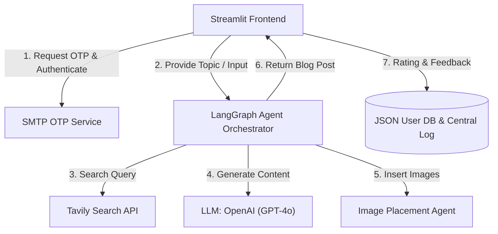

# 📝 AI Agent Blog Writing Platform

A production-ready, containerized multi-agent blog generation platform. Built with **Streamlit** for the frontend, **LangGraph** for orchestrating autonomous research and writing agents, and **Docker** for seamless local and cloud deployments.

This project features a secure OTP-based user registration and admin approval workflow, a persistent user workspace, automated image generation, and a human-in-the-loop refinement interface.

---

## 🚀 Key Features

*   **Multi-Agent LangGraph Pipeline**: Orchestrates specialised research, orchestration, content generation, and image placement agents.
*   **OTP Passwordless Authentication**: Secure login using one-time passcodes sent via email, featuring:
    *   Instant admin bypass configuration.
    *   **Admin Dashboard** for approving/rejecting new access requests.
    *   **Live status polling** ("Check Approval Status" button) for pending users.
*   **Aesthetic User Workspace**: Sleek responsive design utilizing custom CSS styling, welcoming users by name, and displaying a history of their past generated blogs.
*   **Refinement Feedback Loop**: Allows users to rate generated blogs, write comments, and request real-time modifications before saving.
*   **Dockerized Stack**: Simple cross-platform setup using Docker Compose with persistent data volumes for user sessions and assets.

---

## 🛠️ Tech Stack

*   **Frontend**: Streamlit, Custom CSS
*   **Orchestration & Agents**: LangGraph, LangChain
*   **AI Integration**: OpenAI (GPT models), Tavily Search (Research tool)
*   **Observability & Tracing**: LangSmith
*   **Email Service**: SMTP
*   **Containerization**: Docker, Docker Compose
*   **Cloud Infrastructure**: AWS EC2, Elastic IP

---

## 📐 Architecture

### 🌐 High-Level System Flow


### 🔄 LangGraph Agent Workflow (`backend2.py`)

```mermaid
graph TD
    Start([START]) --> StartRouter{start_router}
    
    StartRouter -->|user_feedback present| RefineNode[refine_node]
    StartRouter -->|new topic request| RouterNode[router_node]
    
    RouterNode --> RouteNext{route_next}
    RouteNext -->|needs_research = true| ResearchNode[research_node]
    RouteNext -->|needs_research = false| OrchestratorNode[orchestrator_node]
    
    ResearchNode --> OrchestratorNode
    
    OrchestratorNode -->|fanout list of tasks| WorkerNode[worker_node parallel instances]
    
    subgraph ReducerSubgraph [reducer subgraph]
        style ReducerSubgraph fill:#1e1e24,stroke:#3a3a4c,stroke-width:2px
        MergeNode[merge_content] --> DecideImagesNode[decide_images]
        DecideImagesNode --> GenImagesNode[generate_and_place_images]
    end
    
    WorkerNode -->|collect sections| MergeNode
    
    GenImagesNode --> End([END])
    RefineNode --> End
```


#### Node Walkthrough:
*   **`start_router` (Conditional Edge)**: Routes to `refine` if user feedback exists, otherwise starting a fresh run at `router`.
*   **`router_node`**: Uses `gpt-4o-mini` to determine if web research is required.
*   **`research_node`**: Queries Tavily Search in parallel and aggregates deduplicated URLs.
*   **`orchestrator_node`**: Structures the blog into 3-4 tasks with word targets and formatting requirements.
*   **`worker_node`**: Parallel tasks that write each blog section in markdown using `gpt-4o`.
*   **`reducer` (nested subgraph)**:
    *   `merge_content`: Combines sections into a single markdown body in order.
    *   `decide_images`: Plans exactly 1 technical illustration or diagram.
    *   `generate_and_place_images`: Generates the illustration and links it in the markdown.
*   **`refine_node`**: Processes user comments to refine the final markdown file.

---

## ⚙️ Project Structure

```
├── frontend.py           # Streamlit UI & authentication logic
├── backend2.py           # Core LangGraph agent orchestration & LLM pipeline (OpenAI GPT-4o)
├── requirements.txt      # Python dependencies
├── Dockerfile            # Container build specification
├── docker-compose.yml    # Multi-container service configuration
└── users/                # Persistent storage for user databases (JSON)
```

---

## 🌐 Live Application Access

This application is deployed and hosted live on AWS. To request the deployed URL and credentials for private testing/viewing, please contact:

✉️ **[khan.15@alumni.iitj.ac.in](mailto:khan.15@alumni.iitj.ac.in)**
